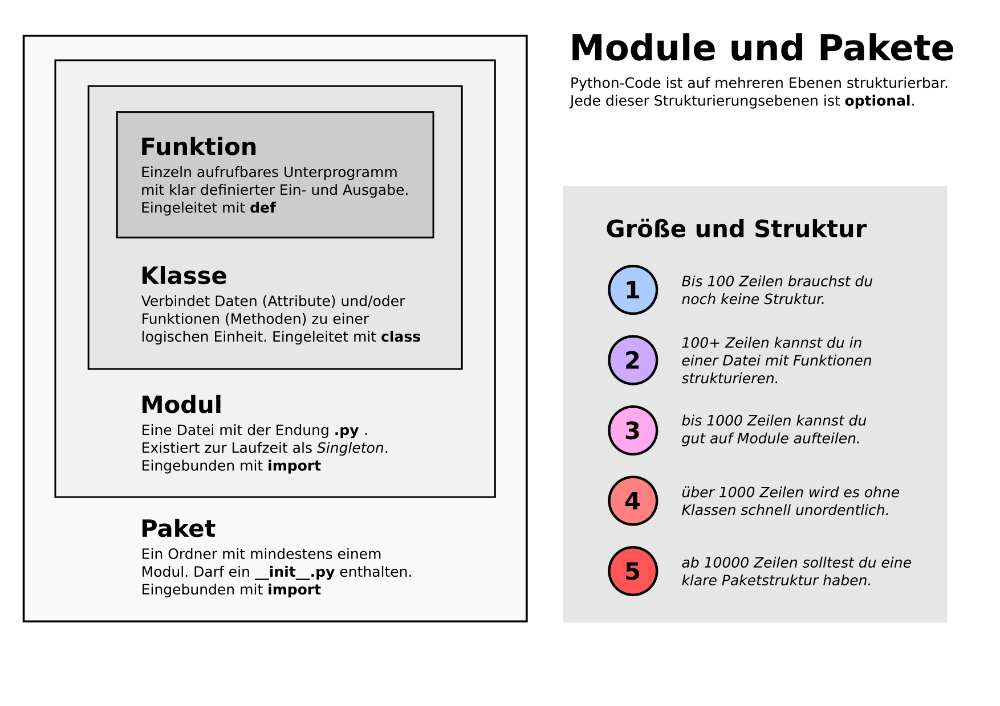

2. Struktur von Python-Projekten
================================

- Funktionen
- Klassen und Methoden
- Module und Pakete
- Ausliefern von Software

Hierarchie der Strukturebenen in Python
---------------------------------------

Aufgabe
-------

.. toctree::
   :maxdepth: 1

   build_package.rst

Links
-----

- `Module <https://python-basics-tutorial.readthedocs.io/de/latest/modules/index.html>`__
- `Bibliotheken <https://python-basics-tutorial.readthedocs.io/de/latest/libs/index.html>`__
- `uv Homepage <https://docs.astral.sh/uv/>`__
- `uv im Python-Basics Tutorial <https://python-basics-tutorial.readthedocs.io/en/latest/libs/distribution.html#uv>`__
