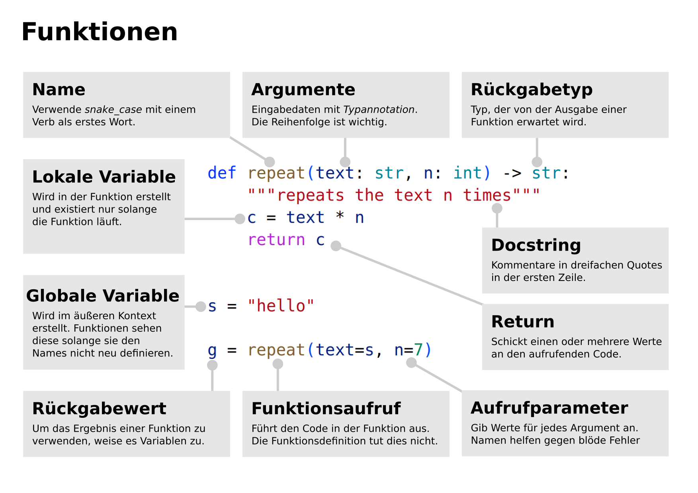

3. Funktionen
=============

- Obligatorische und optionale Parameter
- Parameter mit Sternchen
- Globale und lokale Variablen

Aufbau von Python-Funktionen
----------------------------

Aufgaben
--------

.. toctree::
   :maxdepth: 1

   refactor.rst

Links
-----

- `Funktionen <https://python-basics-tutorial.readthedocs.io/de/latest/functions/index.html>`__
- `Funktionen und Parameter <https://www.academis.eu/advanced_python/functions/function_parameters.html>`__
