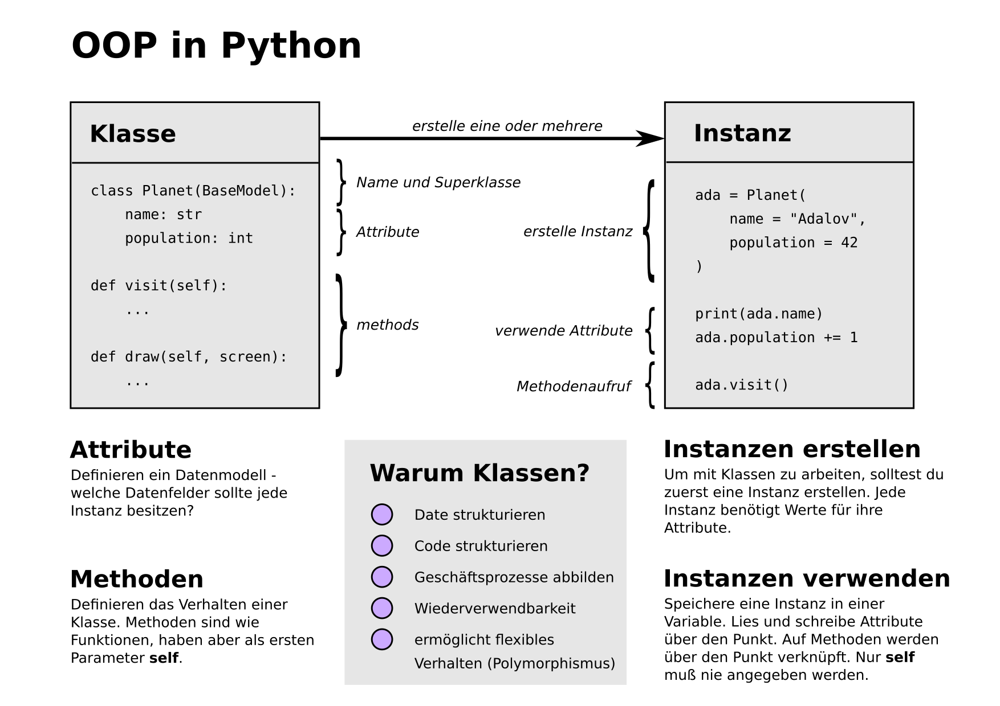
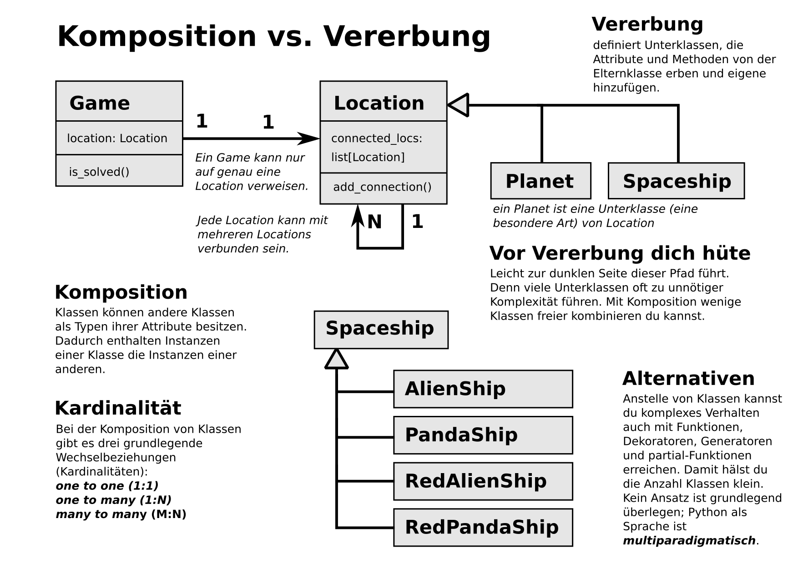

4. Klassen in Python
====================

1. Objektorientiertes Design
2. Datentypen und Typannotationen
3. Klassen mit pydantic
4. Methoden
5. Überladen von Operatoren
6. Vererbung und Polymorphismus
7. Multiple Vererbung / Mixins
8. Typische Entwurfsmuster

Aufbau von Klassen
------------------

----

Beispiele
---------

- :download:`space/cli.py`
- :download:`space/game.py`
- :download:`space/location.py`
- :download:`space/mini_galaxy.json`

Aufgaben
--------

.. toctree::
   :maxdepth: 1

   nonogramme/README.md
   space/README.rst

Links
-----

- `OOP in Python <https://python-basics-tutorial.readthedocs.io/de/latest/oop/index.html>`__
- `Beispielcode mit Klassen <https://www.academis.eu/advanced_python/classes/classes.html>`__
- `Pydantic <https://docs.pydantic.dev/>`__
- `Video: Pythonic objects <https://www.youtube.com/watch?v=k55d3ZUF3ZQ>`__
- `Video: Metaclasses <https://www.youtube.com/watch?v=7PzeZQGVPKc>`__

