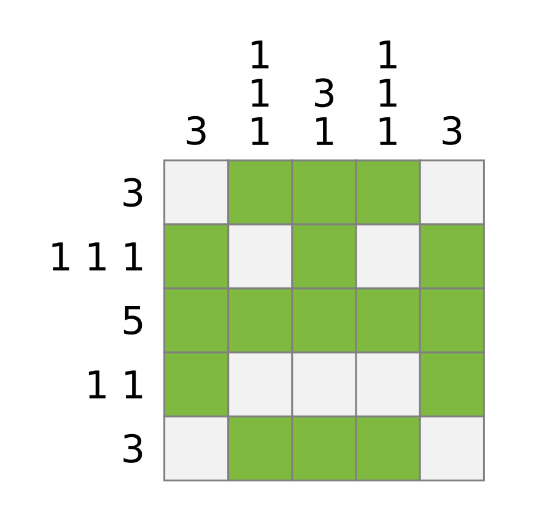

# Nonogramme

Ein [Nonogramm](https://de.wikipedia.org/wiki/Nonogramm) ist eine Art binäres Sudoku.
Die Spieler müssen Felder einfärben.
Am Ende muß die Anzahl eingefärbeter Felder genau mit den Zahlen an jeder Zeile und Spalter übereinstimmen.
Gibt es mehrere Zahlen, müssen entsprechend viele Gruppen in exakt der angegebenen Reihenfolge erstellt werden.
Jede Gruppe muß von der nächsten durch ein leeres Feld getrennt sein.

In dieser Übung werden wir ein bereits vorhandenes Nonogramm **überprüfen**.

## Übung 1: Datenstrukturen

Schlage eine Python-Datenstruktur für Nonogramme vor.
Implementiere diese mit Hilfe von **Typannotationen**.
Verwende die Datenstruktur, um das Nonogramm aus dem Bild zu repräsentieren.

## Übung 2: Gesamte Pixel

Zähle die gesamte Anzahl Pixel im Nonogramm aus.

## Übung 3: Zeilen und Spalten

Prüfe für jede Zeile und Spalte, ob die Anzahl Pixel mit der Annotation übereinstimmt.

## Übung 4: Gruppen

Berücksichtige bei der Prüfung auch die Aufteilung in Gruppen.

## Übung 5: Typannotation prüfen

Schreibe Typannotation zu allen Funktionen.
Überprüfe das Programm anschließend mit `mypy` auf Konsistenz.
