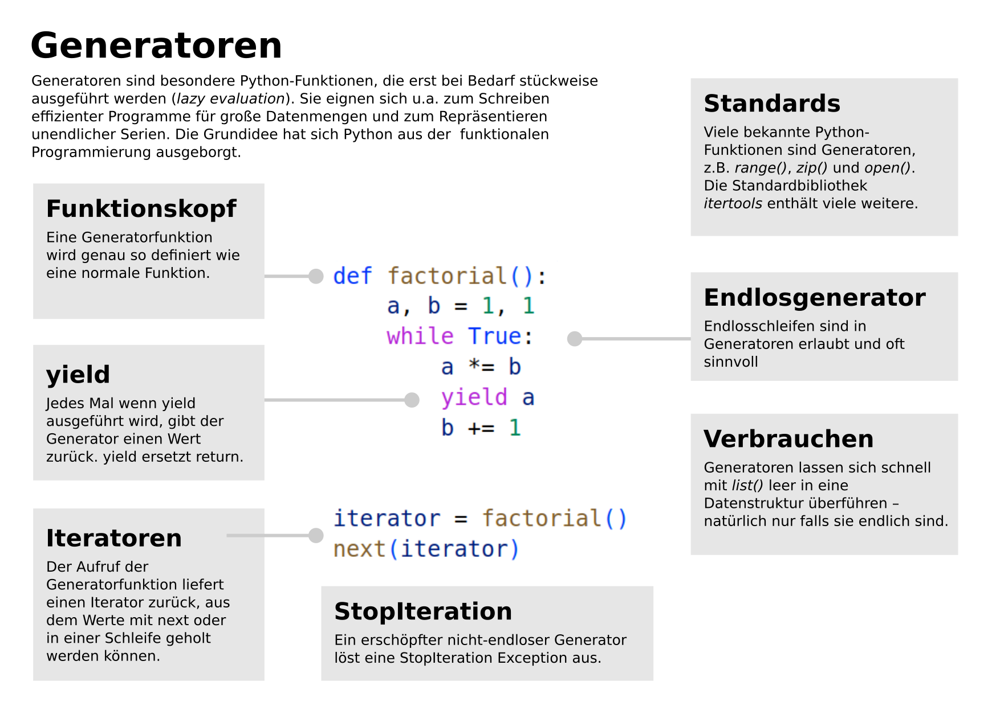

5. Generatoren
==============

- Sequenzielle Datentypen
- Generierte Sequenzen
- Lesen großer Dateien
- Elemente funktionaler Programmierung

Hintergrundinfos
----------------

.. toctree::
   :maxdepth: 1

   generatoren.rst

Aufgabe 1
---------

Schreibe einen Generator, der Fibonacci-Zahlen produziert.

Aufgabe 2
---------

Schreibe einen Generator, der Stellen von Pi mit zunehmender Genauigkeit berechnet.
Verwende die **Madhava-Formel** (400 Jahre später von Leibnitz neu entdeckt):

.. math::

   \pi = 4 \cdot \sum \frac{1}{1} - \frac{1}{3} + \frac{1}{5} - \frac{1}{7} ...

Aufgabe 3
---------

Ermittle sämtliche **leaf nodes** des Baumes aus dem **zwanzig Fragen**-Programm.

Aufgabe 4
---------

Gib jeden 100-ten Knoten aus. Verwende so wenige Variablen wie möglich.

Links
-----

- `Beispiele für Generatoren <https://www.academis.eu/advanced_python/functions/generators.html>`__
