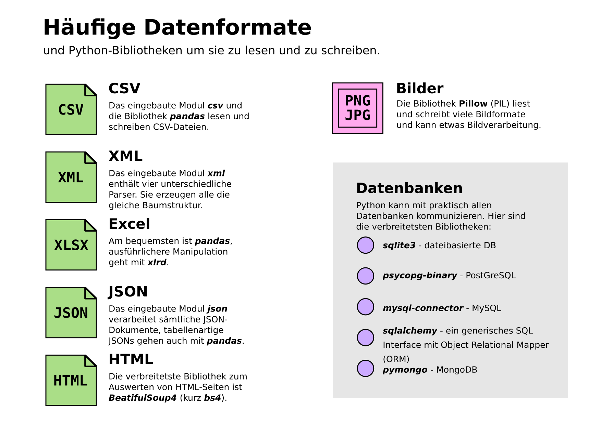

6. Daten Speichern und Lesen
============================

- Objekte speichern
- Datenformate
- Datenbankzugriff

Aufgabe
-------

.. toctree::
   :maxdepth: 1

   datenrundreise/README.md

Links
-----

- `Datenformate <https://python-basics-tutorial.readthedocs.io/de/latest/save-data/index.html>`__
- `pandas go to space Tutorial <https://www.academis.eu/pandas_go_to_space/>`__
