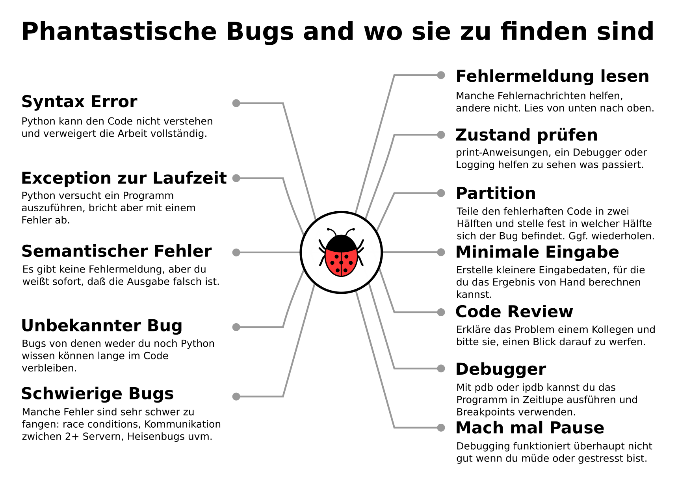

8. Debugging
============

- Debugging-Strategien
- Die logging-Bibliothek
- Der interaktive Debugger

Aufgabe
-------

.. toctree::
   :maxdepth: 1

   irrgartengenerator/debugging.rst

Links
-----

- `Debugging-Strategien <https://www.academis.eu/advanced_python/error_handling/debugging.html>`__
- `Logging <https://www.academis.eu/advanced_python/error_handling/logging.html>`__
