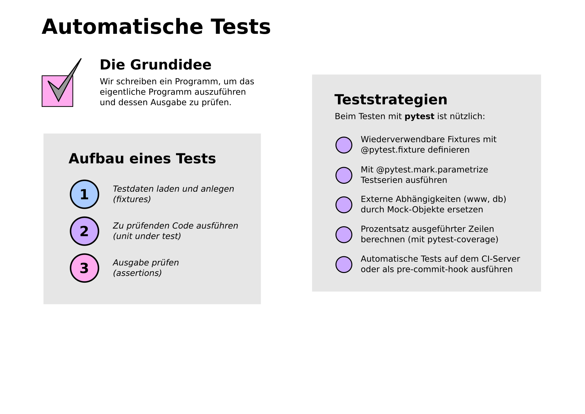
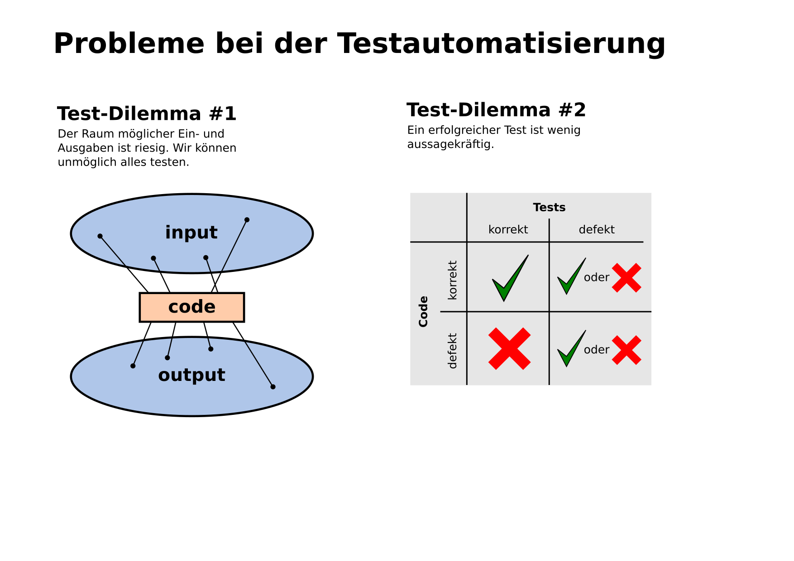

9. Testautomatisierung
======================

- Testen von Programmbibliotheken und Applikationen
- unittest vs. pytest
- Organisation von Testcode

Aufgabe
-------

.. toctree::
   :maxdepth: 1

   roemische_zahlen/roman.rst

Links
-----

- `Testen <https://python-basics-tutorial.readthedocs.io/de/latest/test/index.html>`__
- `Pytest usage guide <https://python-basics-tutorial.readthedocs.io/de/latest/test/pytest/index.html>`__
- `Pytest library <https://docs.pytest.org>`__
- `Tutorial by Kristian <https://www.academis.eu/python_testing/>`__
