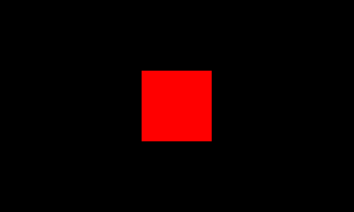
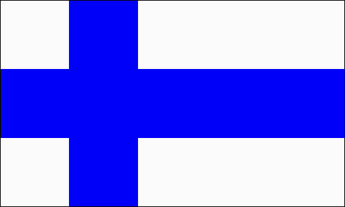

Flaggen
=======

Das Zuschneiden von NumPy-Arrays ermöglicht es, rechteckige Datenblöcke zu bearbeiten.

|image0|

Hier ist der Code, der ein rotes Quadrat aus dem Bild ausschneidet:

.. literalinclude:: flags.py

Hinweise
--------

- Das Zuschneiden enthält für jede Dimension ein Intervall von:bis
- Der kleinste von-Wert ist null
- Der höchste bis-Wert ist die Größe dieser Dimension plus eins
- Negative Zahlen zählen vom Ende her
- Sowohl von als auch bis können weggelassen werden

Übung
-----
Zeichne die Flagge eines Landes deiner Wahl, z.B.:

|image0|

|image1|

