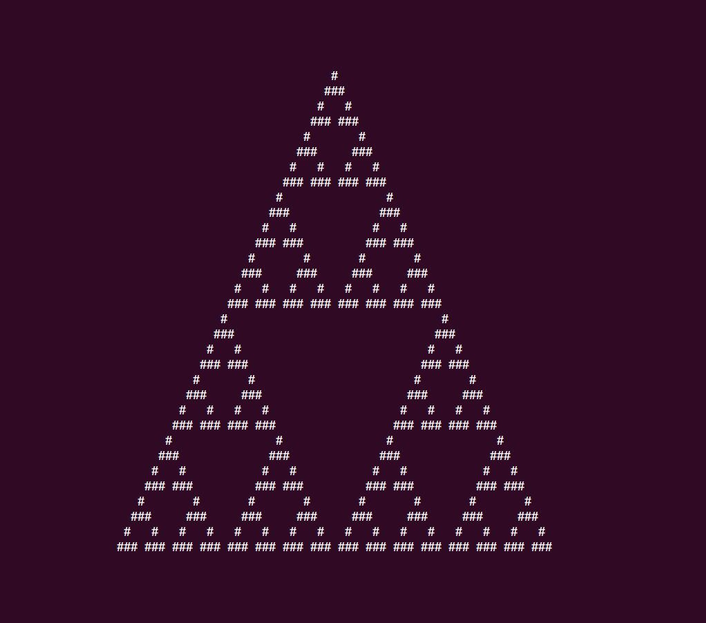

Das Sierpinski-Dreieck
======================

**🎯 Konstruiere ein Sierpinski-Dreieck mit Hilfe eines zellulären Automaten.**

Verwende die folgenden Regeln:

.. code:: python3

   rules = {
       '   ': ' ',
       '  #': '#',
       ' # ': '#',
       ' ##': ' ',
       '#  ': '#',
       '# #': ' ',
       '## ': ' ',
       '###': ' ',
   }

Beginne mit einem String, der eine von je zwei Leerzeichen flankierte Raute enthält:

::

   line = "  #  "

Die Regeln definieren, wie die nächste Zeile aussieht.
Schlage die Zeichentriplette aus dem String nach.
Die drei Triplette `"  #", " # ", "#  "` resultieren in je einer Raute.
Damit erhälst du als zweite Zeile:

::

   ###

Nach einer weiteren Runde erhälst du:

::

   #   #

Nach einer vierten Runde erhälst du insgesamt:

::

      #
     ###
    #   #
   ### ###

Schreibe ein Programm, das die folgende Startzeile 32 mal entwickelt:

.. code:: python3
   
   line = " " * 32 + "#" + " " * 32

Füge nach jeder Runde ein Leerzeichen links und rechts hinzu, so daß die Länge des Strings gleich bleibt.

.. hint::

   Du kannst mit den Regeln herumexperimentieren, um neue Muster zu erzeugen.

.. seealso::

   `Das Sierpinski-Dreieck auf Wikipedia <https://de.wikipedia.org/wiki/Sierpinski-Dreieck>`__
