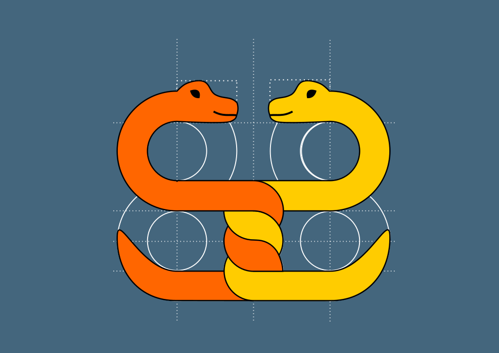

Python für Fortgeschrittene
===========================

Kursmaterialien auf Deutsch

Inhalt
------

.. toctree::
   :maxdepth: 1

   README.md
   installation.rst
   01_python_grundlagen/README.rst
   02_struktur/README.rst
   03_funktionen/README.rst
   04_klassen/README.rst
   05_generatoren/README.rst
   06_daten_lesen_schreiben/README.rst
   07_web_programmierung/README.rst
   08_debuggen/README.rst
   09_testautomatisierung/README.rst
   10_parallele_prozessierung/README.rst
   05_generatoren/dekoratoren/decorators.rst
   11_weiteres/mandelbrot/profiling.rst
   11_weiteres/sierpinski/sierpinski.rst
   links.md

Code aus der Schulung
---------------------

- :download:`ergebnis_tabelle.xlsx`
- :download:`solutions/comprehensions.py`
- :download:`solutions/decorators.py`
- :download:`solutions/generators.py`
- :download:`solutions/copy_deepcopy.py`
- :download:`solutions/elephants.py`
- :download:`solutions/magic_mock.py`
- `Vollständiger Code auf GitHub <https://github.com/krother/advanced_python_de>`__

.. hint::

   Über GitHub findest du auch die Paketstruktur von `space_game` mit Tests und Mock.

Autor
-----

© 2024 Dr. Kristian Rother

Usable under the conditions of the Creative Commons Attribution
Share-Alike License 4.0 (CC-BY-SA 4.0). See creativecommons.org for
details.
